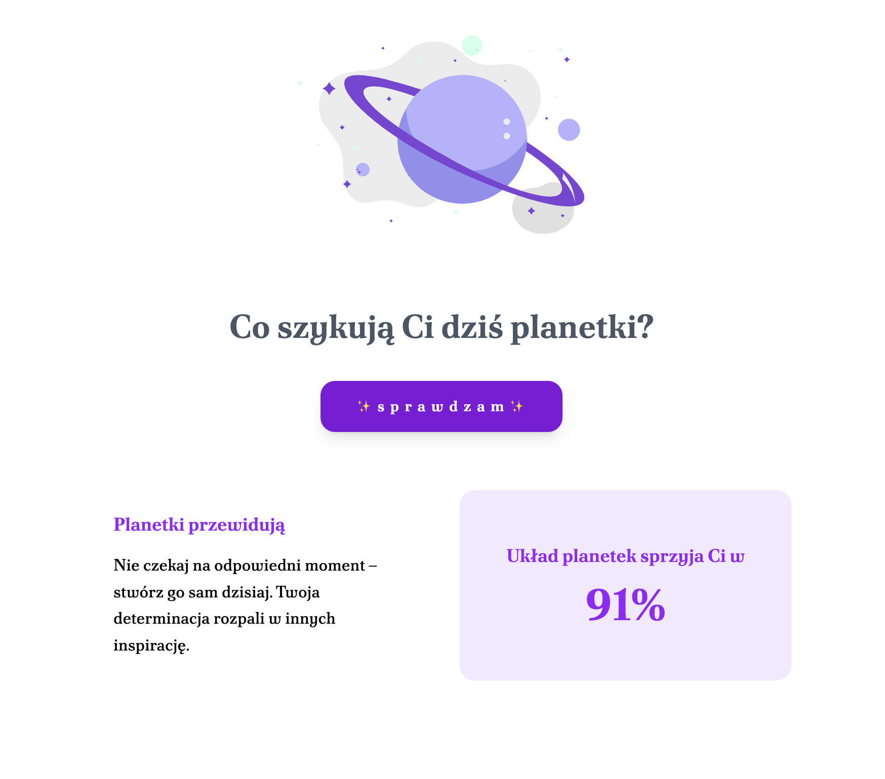

# 🔮 Horoscope Generator

A ✨ s m o l ✨ full-stack project built to test **Node.js** and **React**.  
It provides a simple [**API**](https://github.com/basial/horoscope-api) that serves random horoscopes in different tones, and a [**frontend**](https://github.com/basial/horoscope-frontend) that displays them with your luck percentage animation.

---

## 🚀 Live Demo

✨ [**planetki.pl**](https://www.planetki.pl) ✨ 
_First request might be slow, as Render goes to sleep when there is no traffic_

- **API**: [Deployed to Render](https://horoscope-api-adcu.onrender.com/api/horoscope)  
- **Frontend**: [Deployed to Netlify](https://incredible-monstera-6f0b64.netlify.app/)

---

## 🛠️ Tech Stack
- **Backend**: Node.js, Express  
- **Frontend**: React, Vite, TailwindCSS  
- **Testing**: Vitest, React Testing Library, Jest-DOM  
- **Deployment**: Render (backend), Netlify (frontend)  
- **CI/CD**: GitHub Actions  
